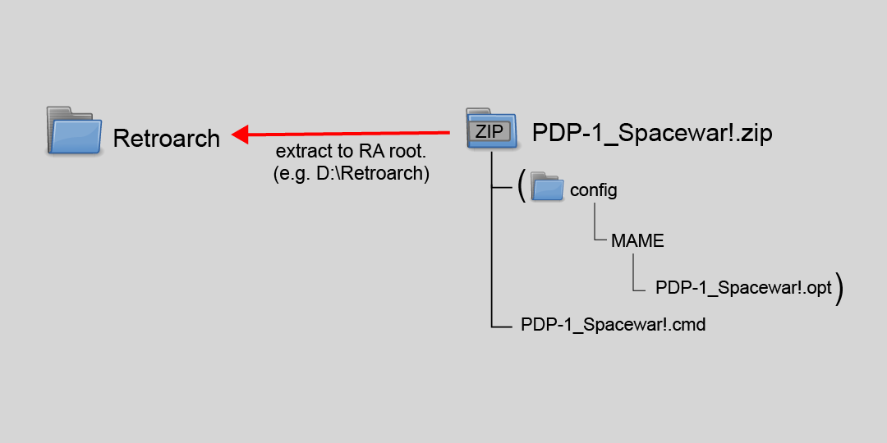

### **PDP-1 Spacewar! instructions.**   

Make sure my graphics and presets are updated with the new PDP-1 assets.

In this folder you will find a "PDP-1_Spacewar!.zip" file. Unpack it to your Retroarch folder.



Execute the "pdp1.cmd" batch file that is in your root Retroarch folder.

...contents of batch file...

```dos
retroarch.exe -L ".\cores\mame_libretro.dll" "pdp1 -ptap1 .\shaders\Duimon-Mega-Bezel\Graphics\PDP-1_Spacewar!\spacewar!.rim"
```
 
Once the content is loaded you need to press Crtl+ENTER to start the tape reader input.

Use the "B" button on your game pad to accelerate, the "A" button to fire, and the D-pad to turn.

Unless you have two game pads, both ships will respond to the input. It is still fun to play. :smile:

 The Numpad numbers control PDP-1 "Sense" switches to change certain parameters in the game.
 
 **Switch/Number Key** -------------------- **Function**
 
1. **Ship Rotation** ------------------ (On: Inertial/Angular momentum, Off: Bergenholm/Gyros)
2. **Twin-Star Mode** --------------- (On: visual displacements, Off: Normal display)
3. **Torpedos** ----------------------- (On: single shot, Off: salvoes)
4. **Background** -------------------- (On: none, Off: starfield)
5. **Gravitational Star - Collision** -- (On: kills, Off: warps to anti-pode)
6. **Gravitational Star - Display** --- (On: big star off. Off: big star on)

That should be it. Have fun with a little video game history!
